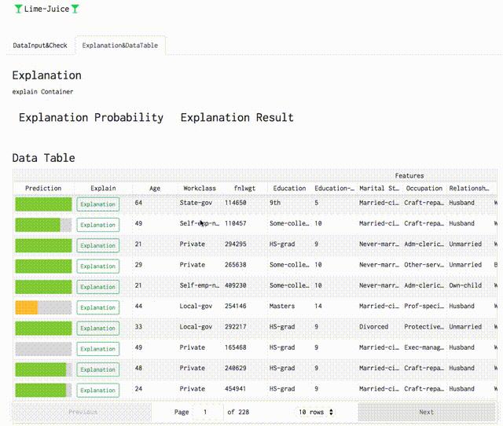
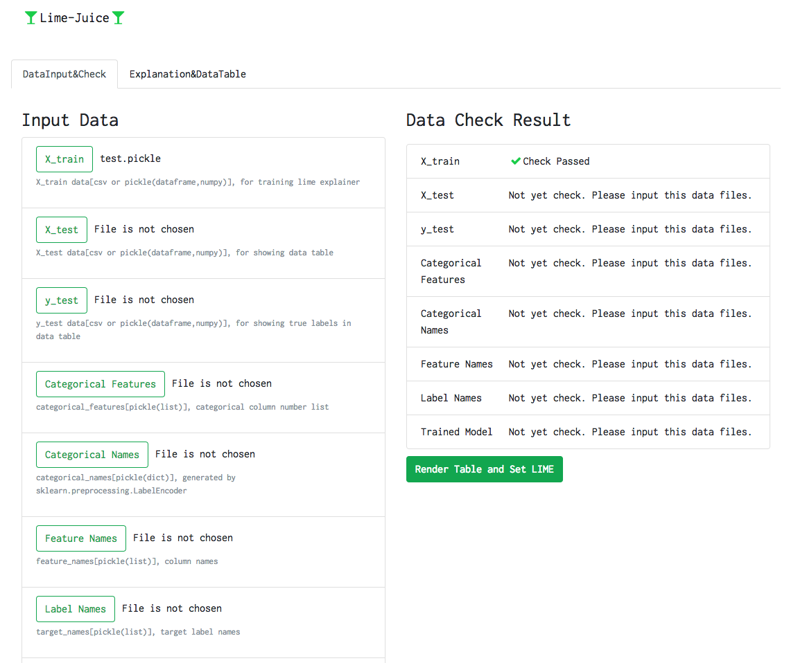
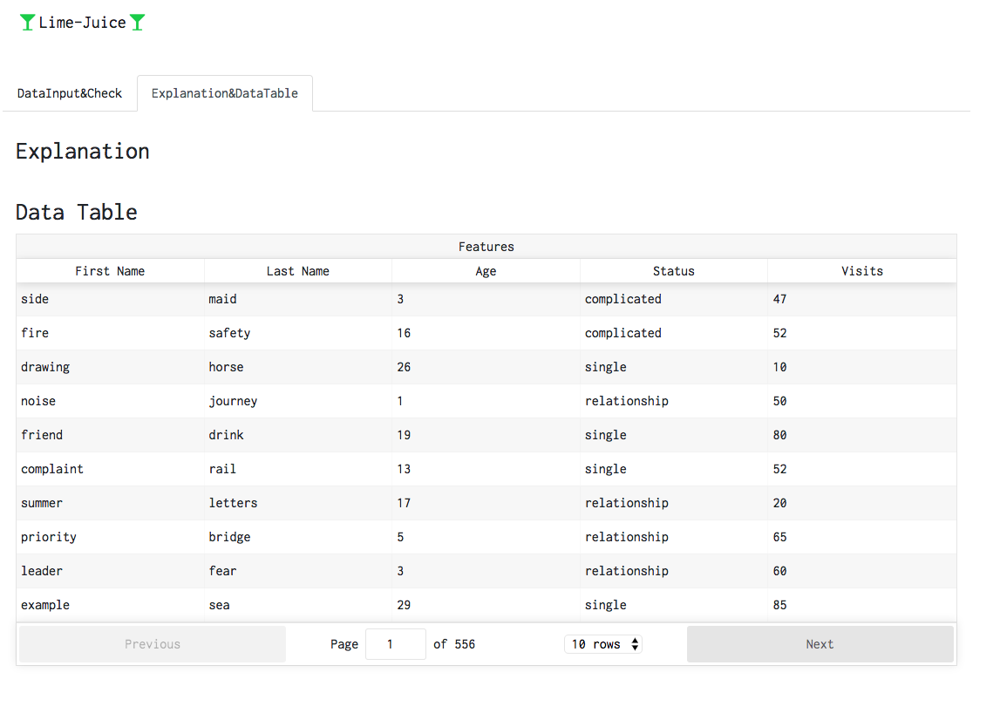

# lime-juice
Lime-Juice: Interactive Interface based on Lime

## Overview
This repository provides web-interface to use the Lime(https://github.com/marcotcr/lime).

## Requirements
This interface uses React(Frontend) and Falcon(api).
About some packages, please see package.json and requirements.txt.

## Demo[WIP]

## Screenshots[WIP]

